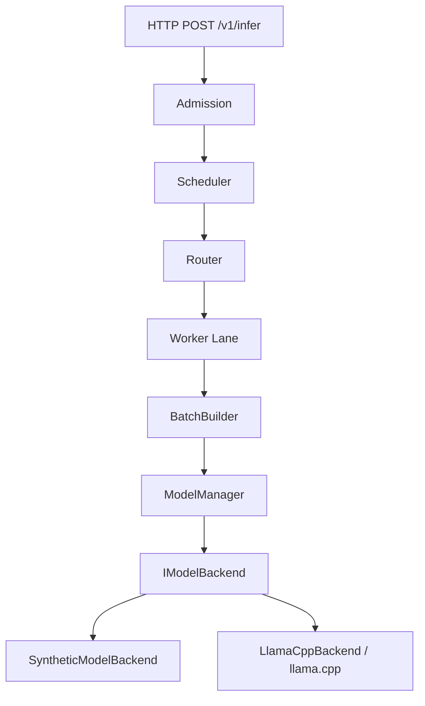

# Architecture

Adaptive AI Inference Runtime is a C++20 multi-model inference control plane. It focuses on scheduling, batching, worker routing, memory-constrained residency, reliability, and a thin HTTP surface — with an optional library-level llama.cpp GGUF backend.

## Major components

- **HTTP serving** (`airuntime_serving`): Boost.Beast/Asio, one request per connection
- **Runtime**: admission, global scheduler, router thread, worker set
- **Worker**: bounded lane, `BatchBuilder`, `ModelManager`, `IModelBackend`
- **Policies**: FIFO / WorkloadAware scheduler; RoundRobin / LeastLoaded / ResidencyAware router; LRU / CostAware eviction
- **Backends**: `SyntheticModelBackend` (deterministic control-plane tests) and optional `LlamaCppBackend` (pinned llama.cpp)

## Request lifecycle

1. Client `POST /v1/infer`
2. Admission claims a queue slot (or rejects with `QueueFull` → HTTP 503)
3. Scheduler holds the request
4. Router selects a worker from snapshots
5. Worker lane `wait_push_until` (deadline-aware)
6. `BatchBuilder` forms a same-model static batch
7. `ModelManager.ensure_resident` (estimate-based memory + eviction)
8. Backend `infer_batch`
9. Terminal state: Completed / Failed / Cancelled / TimedOut

## Thread model

- One routing thread in `Runtime`
- One execution thread per `Worker`
- HTTP runs on Boost.Asio `io_context` (server process)

Workers execute batches serially on their own thread. llama contexts are not shared across workers.

## Ownership

```
Runtime
├── scheduler
├── router
└── workers[]
    ├── backend
    ├── ModelManager → backend
    └── lane queue
```

Optional llama path: process-scoped `shared_ptr<LlamaBackendRuntime>` outlives worker backends/models/contexts.

## Batching

`BatchBuilder` finalizes contiguous same-model batches up to `max_batch_size`, optionally waiting up to `max_batch_wait`. The backend consumes that finalized batch. M5 llama path implements **real multi-sequence** decode — not serial `infer` loops. No continuous batching.

## Residency

`ModelManager` + `ResourceManager` use **estimated** memory budgets. Eviction policies choose victims under pressure. Estimates are not measured VRAM/RAM.

## Reliability

First-terminal-wins for Complete / Fail / Cancel / Timeout. Cooperative cancellation; no Metal hard preemption / abort-callback cancel. `/v1/infer/stream` is lifecycle NDJSON only (not token streaming).

## Backends

| Backend | Role |
|---------|------|
| Synthetic | Fast deterministic control-plane evaluation |
| LlamaCppBackend | Official llama.cpp library API @ pinned SHA, GGUF, Metal/CPU |

## Mermaid lifecycle


